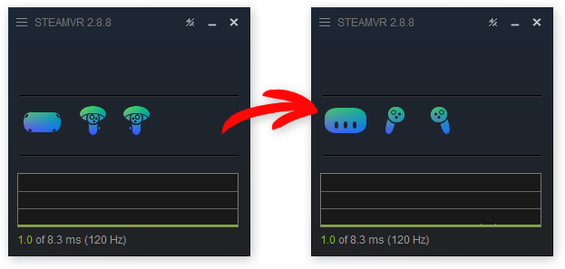
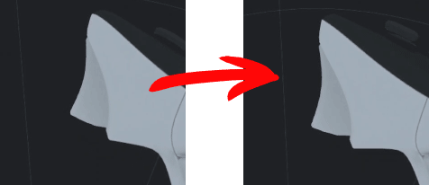
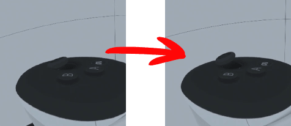
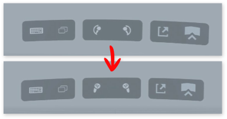

# SteamVR + Quest 3: Minor Visual Fixes
As they say, I did it because Valve didn't.

## Installation
* Click the green **"Code"** button on the above page, then **"Download ZIP"** (or [click here](https://github.com/OddMorning/SteamVR-Quest3-Visual-Fixes/archive/refs/heads/main.zip)).
* Unpack the contents of the `SteamVR` folder into `...\Steam\steamapps\common\SteamVR`.
* _Optionally_, unpack the contents of the `Extra/SteamVR` folder into `...\Steam\steamapps\common\SteamVR`.

## UI Icons
Both headset and controller icons are made from scratch. The source file can be found in the `src` folder.

## Controller Models
Fixed origin points of triggers and sticks. 

P.S. Sadly, it seems it's not possible to fix the wrong controllers position without editing all the .obj files themselves.

#### Edited data (a note for future me if something go wrong):
* _oculus_quest_plus_controller_left.json_
    * `components.trigger.motion.pivot`
        * `[-0.0031, -0.0287, 0.040629]` => `[0.01484, -0.02159, 0.03480]`
    * `components.thumbstick.motion.center`
        * `[0.00069, -0.00769, 0.05279]` => `[-0.00542, -0.00878, 0.04499]`
* _oculus_quest_plus_controller_right.json_
    * `components.trigger.motion.pivot`
        * `[0.0031, -0.0287, 0.040629]` => `[-0.01484, -0.02159, 0.03480]`
    * `components.thumbstick.motion.center`
        * `[0.00169, -0.00769, 0.05279]` => `[0.00542, -0.00878, 0.04499]`

## Extra
The `Extra` folder contains Quest 3 icons replacement for "Dock on Left/Right Controller" buttons

## Changelog

* **Feb 07, 2025**: Added missing gif files (didn't expect they're actually used)
* **Jan 31, 2025**: Fixed controller pivot points; added missing headset icons
* **Jan 30, 2025**: Replaced Pico 4u controller icons with handmade ones
* **Jan 28, 2025**: UI icons