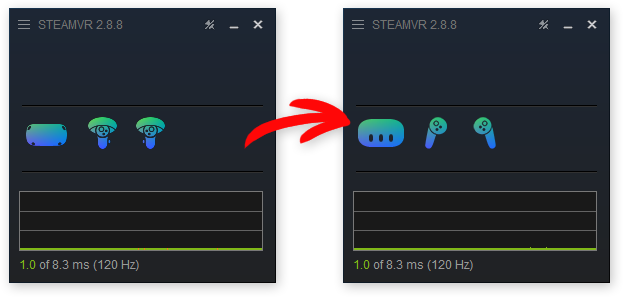

# SteamVR: Visual Fixes for Quest 3
As they say, I did it because Valve didn't.

## Installation
* Click the green **"Code"** button on the above page, then **"Download ZIP"**.
* Unpack the contents of the `SteamVR` folder into `...\Steam\steamapps\common\SteamVR`.

## UI Icons

* The headset icon is made by me.
* The controller icons are recolored Pico 4 Ultra ones as they look quite similar to Quest 3's controllers.

## Controller Models
_(Work in Progress)_